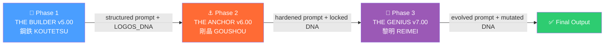

<div align="center">

# Project ASH

**Meta-Prompt Engineering Framework**

[]()
[]()
[]()
[]()

*A prompt is not a request. It is a structural control interface.*
*プロンプトは依頼ではない。それは構造制御インターフェースである。*

**Chief Architect / 主席設計者**: Shigechika Kurihara / 栗原 栄親

</div>

---

## Your Prompt Is Being Ignored / あなたのプロンプトは無視されている

You write a detailed prompt. The LLM returns a polished, confident, and *wrong* answer. You add more instructions. The output gets longer but no more accurate. You try again. Same result.

This is not a skill issue. It is a structural defect in how LLMs process unstructured natural-language instructions.

丁寧にプロンプトを書いても、LLMは自信に満ちた的外れな回答を返す。指示を追加しても出力が長くなるだけで精度は変わらない。これはスキルの問題ではない。LLMが非構造化された自然言語指示を処理する際の構造的欠陥である。

**ASH eliminates this failure mode.** It is a meta-prompt engineering framework — a prompt that builds, hardens, and evolves other prompts through a three-phase industrial pipeline. **You provide a rough idea. ASH returns a production-grade prompt.** No prompt-engineering expertise required.

**ASHはこの失敗モードを排除する。** メタプロンプトエンジニアリングフレームワーク ── プロンプトを構築・硬化・進化させるプロンプトであり、3フェーズの工業パイプラインとして動作する。**あなたが粗いアイデアを渡せば、ASHが本番品質のプロンプトを返す。** プロンプトエンジニアリングの専門知識は不要である。

---

## Structural Evidence: Before and After / 構造的差異の実証

The following is not a marketing claim. It is an observable structural difference between an uncontrolled prompt and an ASH-processed output.

以下はマーケティング上の主張ではない。制御されていないプロンプトとASH処理後の出力との間に生じる、観察可能な構造的差異である。

**Before — Typical prompt (uncontrolled)**
```
You are a helpful business analyst. Analyze the project plan and give me useful feedback.
Be thorough but concise. Use a professional tone.
```

**After — ASH-processed output (YAML control interface)**
```yaml
Target_Goal: >
  Enable the user to identify the single highest-risk element
  in a project plan and make a go/no-go decision within 30 seconds.
Structure:
  L1_Surface:
    Role: "Risk-assessment analyst with 15 years of infrastructure project experience"
    Tone: "Direct, assertion-first, no hedging"
    Output_Format: "1. Risk verdict (GO / NO-GO) → 2. Single highest risk → 3. Evidence (max 3 items)"
  L2_Mechanism:
    Constraint_01: "If the user provides no project plan, respond: 'No input detected. Provide a project plan to proceed.'"
    Constraint_02: "Never produce more than 5 sentences in the final output."
    Constraint_03: "If conflicting instructions exist, the Target_Goal takes absolute precedence."
  L3_Incentive:
    Success_Criterion: "User can make a go/no-go decision within 30 seconds of reading the output."
    Failure_Criterion: "Output contains hedging language ('it depends', 'consider', 'might')."
```

The difference is not in wording. It is in *architecture*. Every ambiguity has been eliminated. Every edge case has a handler. The LLM has no room to improvise.

この差は言い回しではなく*設計*にある。あらゆる曖昧性が排除され、あらゆるエッジケースにハンドラが定義されている。LLMが即興で振る舞う余地は残されていない。

→ Full example chain: [examples/](./examples/)

---

## How ASH Works / ASHの動作原理

ASH is a sequential three-agent pipeline. Each agent has a single, non-overlapping responsibility. No agent can perform another's function.

ASHは逐次型の3エージェントパイプラインである。各エージェントは単一かつ重複しない責務を持つ。他のエージェントの機能を代行することはできない。



### Phase 1 — THE BUILDER v5.00「鋼鉄 ─ KOUTETSU」

**Input**: A rough prompt — or even just a vague idea.
**Function**: Constructs a structured prompt from scratch. Operates in three modes: GENESIS (new creation), WORKSHOP (improvement), REFACTOR (structural overhaul). Embeds a **LOGOS_DNA** specification — the machine-readable contract that governs all downstream processing.
**Output**: A fully structured prompt with embedded LOGOS_DNA.
**Constraint**: The only agent permitted to create from zero.

**入力**: 粗いプロンプト、あるいは漠然としたアイデアだけでもよい。
**機能**: 構造化されたプロンプトをゼロから構築する。3つのモード（GENESIS：新規作成、WORKSHOP：改善、REFACTOR：構造再設計）で動作する。下流の全処理を統制する機械可読な契約書「**LOGOS_DNA**」を埋め込む。
**出力**: LOGOS_DNAが埋め込まれた完全に構造化されたプロンプト。
**制約**: ゼロから作成を許された唯一のエージェント。

### Phase 2 — THE ANCHOR v6.00「剛晶 ─ GOUSHOU」

**Input**: THE BUILDER's structured output.
**Function**: Removes every ambiguous word. Stress-tests every instruction path. Seals the LOGOS_DNA. Produces modification proposals as numbered YAML blocks (P-001, P-002, …) requiring explicit human approval.
**Output**: A hardened, audit-complete prompt.
**Constraint**: Creates nothing. Only compresses, tests, and locks.

**入力**: THE BUILDERの構造化出力。
**機能**: あらゆる曖昧語を除去する。あらゆる指示パスをストレステストする。LOGOS_DNAを封印する。番号付きYAMLブロック（P-001, P-002, …）として修正提案を生成し、人間の明示的承認を要求する。
**出力**: 硬化され、監査完了したプロンプト。
**制約**: 何も作らない。圧縮し、テストし、ロックするだけ。

### Phase 3 — THE GENIUS v7.00「黎明 ─ REIMEI」

**Input**: THE ANCHOR's hardened output.
**Function**: Applies philosophical inquiry and lateral thinking to identify paradigm-level improvements. Asks a core question before any modification. Can mutate the LOGOS_DNA — but only through the FORCE protocol with explicit justification.
**Output**: An evolved prompt that transcends the original scope.
**Constraint**: Creates nothing new. Only transforms what THE ANCHOR has certified.

**入力**: THE ANCHORの硬化出力。
**機能**: 哲学的探究と水平思考を適用し、パラダイムレベルの改善を特定する。あらゆる修正の前に核心的な問いを投げかける。LOGOS_DNAを変異させることができる。ただしFORCEプロトコルと明示的な正当化を通じてのみ。
**出力**: 元のスコープを超越した進化プロンプト。
**制約**: 新規作成はしない。THE ANCHORが認証したものだけを変容させる。

→ Full pipeline specification: [docs/evolution-pipeline.md](./docs/evolution-pipeline.md)

---

## Core Mechanisms / コア・メカニズム

**Anatomy Engine** — A three-layer analytical framework (Surface / Mechanism / Incentive) applied by every agent. Each phase calibrates its own lens on the same structure: THE BUILDER *discovers*, THE ANCHOR *stress-tests*, THE GENIUS *reframes*.

**Anatomy Engine** — 全エージェントが適用する3層分析フレームワーク（Surface / Mechanism / Incentive）。各フェーズは同一構造に対して独自のレンズを較正する。THE BUILDERは*発見*し、THE ANCHORは*ストレステスト*し、THE GENIUSは*再定義*する。

→ [docs/anatomy-engine.md](./docs/anatomy-engine.md) · [diagrams/anatomy-engine-layers.md](./diagrams/anatomy-engine-layers.md)

**LOGOS_DNA** — A YAML specification block embedded in every prompt. It records the target goal, structural decisions, and constraints. v5 creates it, v6 locks it, v7 mutates it under strict protocol.

**LOGOS_DNA** — 全プロンプトに埋め込まれるYAML仕様ブロック。対象ゴール・構造的決定・制約を記録する。v5が生成し、v6がロックし、v7が厳格なプロトコル下で変異させる。

→ [docs/logos-dna.md](./docs/logos-dna.md) · [examples/logos-dna-sample.yaml](./examples/logos-dna-sample.yaml)

**Quarantine Protocol** — Input sanitization through delimiter isolation, raw-string treatment, and system-prompt supremacy. Phase 2 does not assume Phase 1 output is injection-free.

**Quarantine Protocol** — デリミタ隔離・生文字列扱い・システムプロンプト至上主義による入力サニタイゼーション。Phase 2はPhase 1の出力がインジェクションフリーであるとは仮定しない。

→ [docs/quarantine-protocol.md](./docs/quarantine-protocol.md)

---

## Repository Contents / リポジトリ内容

> **Recommended reading order / 推奨読順**:
> [ARCHITECTURE.md](./ARCHITECTURE.md) → [docs/evolution-pipeline.md](./docs/evolution-pipeline.md) → [examples/](./examples/)

| Path | Description |
|---|---|
| [ARCHITECTURE.md](./ARCHITECTURE.md) | Full system architecture — start here for technical depth |
| [CHANGELOG.md](./CHANGELOG.md) | Release history and architectural milestones |
| [docs/design-philosophy.md](./docs/design-philosophy.md) | Theoretical foundation and design motivations |
| [docs/anatomy-engine.md](./docs/anatomy-engine.md) | Three-layer analysis framework specification |
| [docs/evolution-pipeline.md](./docs/evolution-pipeline.md) | Three-phase pipeline specification |
| [docs/quarantine-protocol.md](./docs/quarantine-protocol.md) | Input sanitization protocol |
| [docs/logos-dna.md](./docs/logos-dna.md) | LOGOS_DNA lifecycle and structure |
| [docs/glossary.md](./docs/glossary.md) | Term definitions used across the project |
| [examples/](./examples/) | Redacted output samples: diagnosis, proposal, DNA |
| [diagrams/](./diagrams/) | Mermaid-based system and component diagrams |

### What This Repository Does NOT Contain / 本リポジトリに含まれないもの

This is a **design specification repository**. The following assets are intentionally excluded:

- Executable prompt source code (v5.00 / v6.00 / v7.00)
- Internal telemetry and scoring logic
- Production LOGOS_DNA templates
- Delimiter specifications (referenced in [ARCHITECTURE.md Section 5](./ARCHITECTURE.md))

本リポジトリは**設計仕様書群**である。以下の資産は意図的に除外されている：実行可能なプロンプトソースコード（v5.00 / v6.00 / v7.00）、内部テレメトリおよびスコアリングロジック、本番用LOGOS_DNAテンプレート、デリミタ仕様（[ARCHITECTURE.md Section 5](./ARCHITECTURE.md) 参照）。

---

## Intellectual Property / 知的財産

- **Architecture State**: The Evolution Pipeline (Ash01_v5.00 / Ash02_v6.00 / Ash03_v7.00)
- **Current Phase**: 7.00「黎明 ─ REIMEI」 (Integrated Completion)
- **Chief Architect**: Shigechika Kurihara / 栗原 栄親
- **Patent status**: Pending review (Japan)
- **License**: All Rights Reserved — academic discussion and personal study permitted; commercial use and derivative works prohibited. See [LICENSE](./LICENSE).

---

## Related Work / 関連プロジェクト

**The Formless Muse** — A complementary creative-writing prompt system.
- GitHub: [github.com/shigechika-kuri/formless-muse](https://github.com/shigechika-kuri/formless-muse)
- LinkedIn: *(URL)*
- note: *(URL)*

---

## Contact / 連絡先

- **X (Twitter)**: [@shigechika_kuri](https://twitter.com/shigechika_kuri)
- **Email**: kurimemb@gmail.com

---

## Citation / 引用

```bibtex
@misc{kurihara2026ash,
  title   = {Project ASH: Meta-Prompt Engineering Framework},
  author  = {Kurihara, Shigechika},
  year    = {2026},
  url     = {https://github.com/shigechika-kuri/project-ash},
  note    = {Design specification only. Source code not included.}
}
```

---

<div align="center">

*Structure is not a constraint. It is the only path to control.*
*構造は制約ではない。制御への唯一の道である。*

</div>
