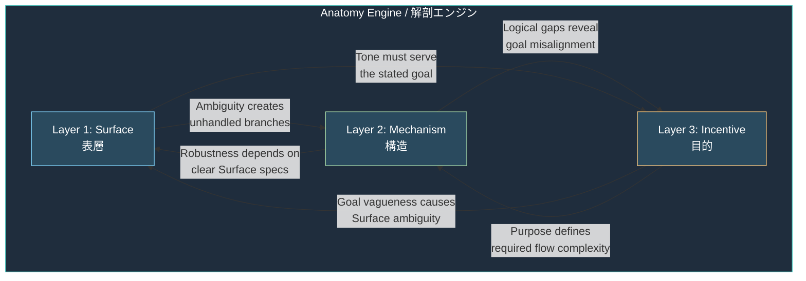
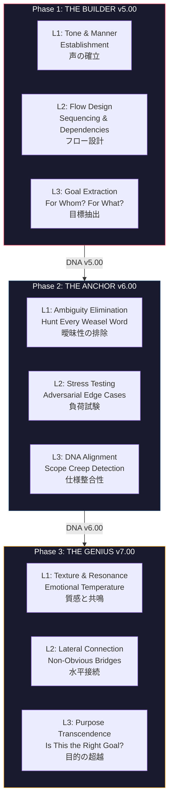

# Three-Layer Analysis: Layer Structure / 3層分析：レイヤー構造図

> **How the three layers interact, and how their analytical focus shifts across pipeline phases.**
>
> **三層がどう相互作用し、分析の焦点がパイプラインフェーズ間でどう変化するか。**
>
> *(Source code designation: Anatomy Engine / ソースコード内呼称：Anatomy Engine)*

---

## Layer Interaction Model / レイヤー相互作用モデル

## Cross-Layer Failure Cascades / レイヤー間の失敗カスケード

The six arrows in the diagram above represent the six cross-layer failure paths that the three-layer analysis traces during every analysis:

上の図の6本の矢印は、3層分析がすべての分析中に追跡する6つのレイヤー間失敗パスを表す：

- **Surface → Mechanism**: Ambiguous language creates unhandled conditional branches. (曖昧な言語が処理されていない条件分岐を生む。)
- **Mechanism → Incentive**: Logical gaps expose goal misalignment. (論理的な穴が目標の不整合を露出させる。)
- **Incentive → Surface**: Undefined goals make tone calibration impossible. (未定義の目標がトーン較正を不可能にする。)
- **Mechanism → Surface**: Robust fallbacks require unambiguous baseline specifications. (堅牢なフォールバックは曖昧さのない基準仕様を要求する。)
- **Surface → Incentive**: Tone mismatch undermines goal achievement regardless of Layer 3 quality. (トーンの不一致はLayer 3の品質にかかわらず目標達成を損なう。)
- **Incentive → Mechanism**: Purpose complexity determines required flow architecture. (目的の複雑性が必要なフローアーキテクチャを決定する。)

→ Full cross-layer verification specification: **[docs/anatomy-engine.md Section 5](../docs/anatomy-engine.md)**

---

## Phase-Specific Lens Calibration / フェーズ固有レンズ較正

## Reading Guide / 読み方ガイド

The three-layer structure (Surface, Mechanism, Incentive) remains identical across all phases. What changes is the **analytical lens** — the specific question each layer asks.

三層構造（Surface、Mechanism、Incentive）はすべてのフェーズで同一に維持される。変わるのは**分析レンズ** — 各レイヤーが問う具体的な問いである。

In **Phase 1**, Layer 1 asks "what voice should this prompt have?" — establishing tone before content. Layer 2 asks "what is the logical sequence?" — designing flow before hardening it. Layer 3 asks "what is this for?" — extracting purpose before building toward it.

**Phase 1**では、Layer 1は「このプロンプトはどの声を持つべきか？」と問う — コンテンツの前にトーンを確立する。Layer 2は「論理的順序は何か？」と問う — 硬化の前にフローを設計する。Layer 3は「これは何のためか？」と問う — 構築の前に目的を抽出する。

In **Phase 2**, Layer 1 asks "where is the ambiguity?" — hunting defects rather than establishing voice. Layer 2 asks "where does the logic break?" — stress-testing rather than designing. Layer 3 asks "does every instruction serve the goal?" — verifying alignment rather than extracting purpose.

**Phase 2**では、Layer 1は「曖昧さはどこにあるか？」と問う — 声の確立ではなく欠陥の探索。Layer 2は「論理はどこで壊れるか？」と問う — 設計ではなくストレステスト。Layer 3は「すべての指示が目標に奉仕しているか？」と問う — 目的の抽出ではなく整合性の検証。

In **Phase 3**, Layer 1 asks "does this prompt have the right temperature?" — refining texture rather than eliminating ambiguity. Layer 2 asks "are there non-obvious connections?" — bridging concepts rather than stress-testing logic. Layer 3 asks "is this the right goal?" — questioning purpose rather than verifying it.

**Phase 3**では、Layer 1は「このプロンプトは正しい温度を持っているか？」と問う — 曖昧性の排除ではなく質感の洗練。Layer 2は「非自明な接続はないか？」と問う — 論理のストレステストではなく概念の架橋。Layer 3は「これは正しい目標か？」と問う — 目的の検証ではなく問いかけ。

Same skeleton. Different eyes. This is the three-layer analysis design.

同じ骨格。異なる眼。これが3層分析の設計である。

---

**Document Version**: 1.1
**Author**: Shigechika Kurihara (栗原栄親)

© 2026 Shigechika Kurihara. All Rights Reserved.
