# Pipeline Flow Diagram / パイプラインフロー図

> **Detailed view of data flow through the three-phase Evolution Pipeline.**
>
> **三段階Evolution Pipelineを通じたデータフローの詳細ビュー。**

---

## Phase Sequence / フェーズシーケンス

```mermaid
graph LR
    subgraph PHASE1["Phase 1: THE BUILDER v5.00"]
        direction TB
        P1_MODE["Mode Selection<br>GENESIS / WORKSHOP / REFACTOR"]
        P1_DIAG["Diagnosis<br>Anatomy Engine Analysis"]
        P1_PROP["Structured Proposals<br>YAML with IDs"]
        P1_APPROVE["Human Approval<br>YES / NO / HOLD"]
        P1_LOG["Decision Log<br>Approved items recorded"]
        P1_BUILD["Construction<br>Full prompt output"]
        P1_DNA["LOGOS_DNA v5.00<br>Birth"]

        P1_MODE --> P1_DIAG
        P1_DIAG --> P1_PROP
        P1_PROP --> P1_APPROVE
        P1_APPROVE --> P1_LOG
        P1_LOG --> P1_BUILD
        P1_BUILD --> P1_DNA
    end

    subgraph PHASE2["Phase 2: THE ANCHOR v6.00"]
        direction TB
        P2_INTAKE["Input Reception<br>DNA Check"]
        P2_DIAG["Diagnosis<br>Hardness Score + Anatomy"]
        P2_PROP["Structured Proposals<br>DNA CONFLICT warnings"]
        P2_APPROVE["Human Approval<br>YES / NO / HOLD / FORCE"]
        P2_OATH["Oath Keeper<br>DNA defense or rewrite"]
        P2_HARDEN["Solidification<br>Full prompt output"]
        P2_DNA["LOGOS_DNA v6.00<br>Hardened"]

        P2_INTAKE --> P2_DIAG
        P2_DIAG --> P2_PROP
        P2_PROP --> P2_APPROVE
        P2_APPROVE --> P2_OATH
        P2_OATH --> P2_HARDEN
        P2_HARDEN --> P2_DNA
    end

    subgraph PHASE3["Phase 3: THE GENIUS v7.00"]
        direction TB
        P3_INTAKE["Input Reception<br>DNA Check"]
        P3_PHILO["Philosophy Mode<br>Foundational Inquiry"]
        P3_ANSWER["Human Response<br>Direction set"]
        P3_PROP["Structured Proposals<br>Mutation Alerts"]
        P3_APPROVE["Human Approval<br>YES / NO / HOLD"]
        P3_MUTATE["Mutation Protocol<br>DNA evolution"]
        P3_TRANSCEND["Transcendence<br>Full prompt output"]
        P3_DNA["LOGOS_DNA v7.00<br>Evolved"]

        P3_INTAKE --> P3_PHILO
        P3_PHILO --> P3_ANSWER
        P3_ANSWER --> P3_PROP
        P3_PROP --> P3_APPROVE
        P3_APPROVE --> P3_MUTATE
        P3_MUTATE --> P3_TRANSCEND
        P3_TRANSCEND --> P3_DNA
    end

    P1_DNA -->|"Prompt +<br>DNA v5.00"| P2_INTAKE
    P2_DNA -->|"Prompt +<br>DNA v6.00"| P3_INTAKE
    P3_DNA -->|"Final Output"| FINAL["Solid State Prompt<br>+ LOGOS_DNA v7.00"]

    style PHASE1 fill:#1a1a2e,stroke:#e94560,color:#fff
    style PHASE2 fill:#1a1a2e,stroke:#0f3460,color:#fff
    style PHASE3 fill:#1a1a2e,stroke:#f5a623,color:#fff
    style FINAL fill:#16213e,stroke:#53d769,color:#fff
```

## Key Differences Between Phases / フェーズ間の主要な違い

### Phase 1: THE BUILDER

The Builder's unique element is **Mode Selection** at the start. Depending on whether the human starts from zero (GENESIS), from notes (WORKSHOP), or from an existing prompt (REFACTOR), the Builder's initial behavior changes. The output flow is linear: diagnose, propose, approve, build.

Builderのユニークな要素は開始時の**モード選択**である。人間がゼロから（GENESIS）、メモから（WORKSHOP）、既存プロンプトから（REFACTOR）のいずれで開始するかに応じて、Builderの初期行動が変わる。出力フローは直線的：診断、提案、承認、構築。

### Phase 2: THE ANCHOR

The Anchor's unique elements are the **Hardness Score** in diagnosis and the **Oath Keeper** mechanism in approval. The Oath Keeper introduces a conditional branch: if the human's requested change conflicts with the DNA, the Anchor resists. If the human issues FORCE, the Anchor complies but rewrites the DNA. This is the only phase where the DNA can be rewritten defensively (to maintain consistency after a forced change).

Anchorのユニークな要素は診断における**Hardness Score**と承認における**誓いの番人**メカニズムである。誓いの番人は条件分岐を導入する：人間が要求した変更がDNAと矛盾する場合、Anchorは抵抗する。人間がFORCEを発行すれば、Anchorは従うがDNAを書き換える。これは強制された変更後の整合性を維持するためにDNAが防衛的に書き換えられ得る唯一のフェーズである。

### Phase 3: THE GENIUS

The Genius's unique element is **Philosophy Mode**: a foundational inquiry that occurs before any technical analysis. The human's answer to the philosophical question sets the direction for all subsequent proposals. The **Mutation Protocol** is also unique to this phase: it is the only mechanism by which the LOGOS_DNA's Target_Goal can be intentionally evolved (as opposed to defensively rewritten).

Geniusのユニークな要素は**Philosophy Mode**：いかなる技術的分析の前にも発生する根源的問いかけである。哲学的問いに対する人間の回答が、すべての後続の提案の方向を設定する。**Mutation Protocol**もこのフェーズに固有である：LOGOS_DNAのTarget_Goalが（防衛的に書き換えられるのではなく）意図的に進化させられ得る唯一のメカニズム。

---

**Document Version**: 1.0
**Author**: Shigechika Kurihara (栗原栄親)

© 2026 Shigechika Kurihara. All Rights Reserved.
