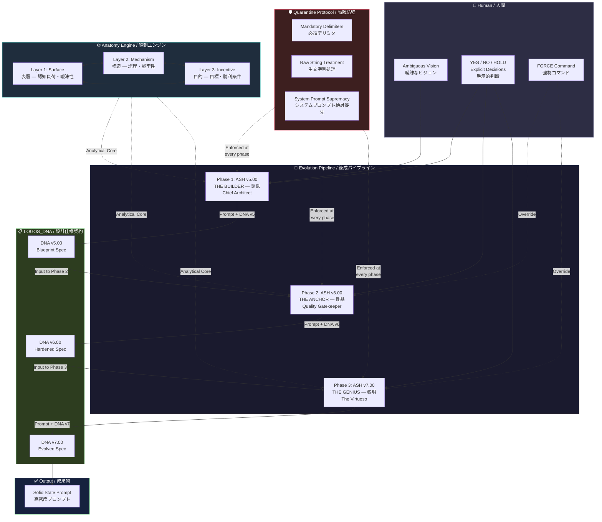

# System Overview Diagram / システム全体図

> **This diagram renders natively on GitHub using Mermaid. No external tools required.**
>
> **この図はMermaidを使用してGitHub上でネイティブにレンダリングされる。外部ツール不要。**

---

## Full Architecture / 全体アーキテクチャ

## Reading Guide / 読み方ガイド

**Human (top)** provides the ambiguous vision and makes all explicit decisions throughout the pipeline. The FORCE command is a special override that compels any phase to comply with a change even when it conflicts with the LOGOS_DNA.

**Human（上部）**は曖昧なビジョンを提供し、パイプライン全体を通じてすべての明示的判断を下す。FORCEコマンドはLOGOS_DNAと矛盾する場合でもいかなるフェーズにも変更への準拠を強制する特別なオーバーライドである。

**Quarantine Protocol (left)** is not a phase. It is a cross-cutting security layer enforced at every pipeline phase. All external text passes through it before analysis.

**Quarantine Protocol（左）**はフェーズではない。すべてのパイプラインフェーズで強制される横断的セキュリティレイヤーである。すべての外部テキストは分析前にこれを通過する。

**Anatomy Engine (left-center)** is not a phase. It is the analytical core shared by all phases. The bidirectional arrows between layers represent cross-layer verification: each layer's findings inform the other two.

**Anatomy Engine（左中央）**はフェーズではない。すべてのフェーズに共有される分析コアである。レイヤー間の双方向矢印はレイヤー間交差検証を表す：各レイヤーの知見が他の二つに情報を提供する。

**Evolution Pipeline (center)** is the sequential processing path. Each phase receives input from the previous phase (accompanied by LOGOS_DNA) and produces output for the next.

**Evolution Pipeline（中央）**は順次的な処理パスである。各フェーズは前のフェーズからの入力（LOGOS_DNAが付帯）を受け取り、次のフェーズのための出力を生む。

**LOGOS_DNA (right-center)** travels with the prompt through every phase, accumulating specification data. v5.00 captures design intent. v6.00 captures hardened state. v7.00 captures evolved purpose.

**LOGOS_DNA（右中央）**はすべてのフェーズを通じてプロンプトと共に移動し、仕様データを蓄積する。v5.00は設計意図を捕捉する。v6.00は硬化状態を捕捉する。v7.00は進化した目的を捕捉する。

**Output (bottom)** is the final Solid State Prompt: high-density, de-ambiguated, purpose-aligned, accompanied by LOGOS_DNA v7.00.

**Output（下部）**は最終的なSolid State Prompt：高密度、曖昧さ除去済み、目的整合、LOGOS_DNA v7.00が付帯。

---

**Document Version**: 1.0
**Author**: Shigechika Kurihara (栗原栄親)

© 2026 Shigechika Kurihara. All Rights Reserved.
